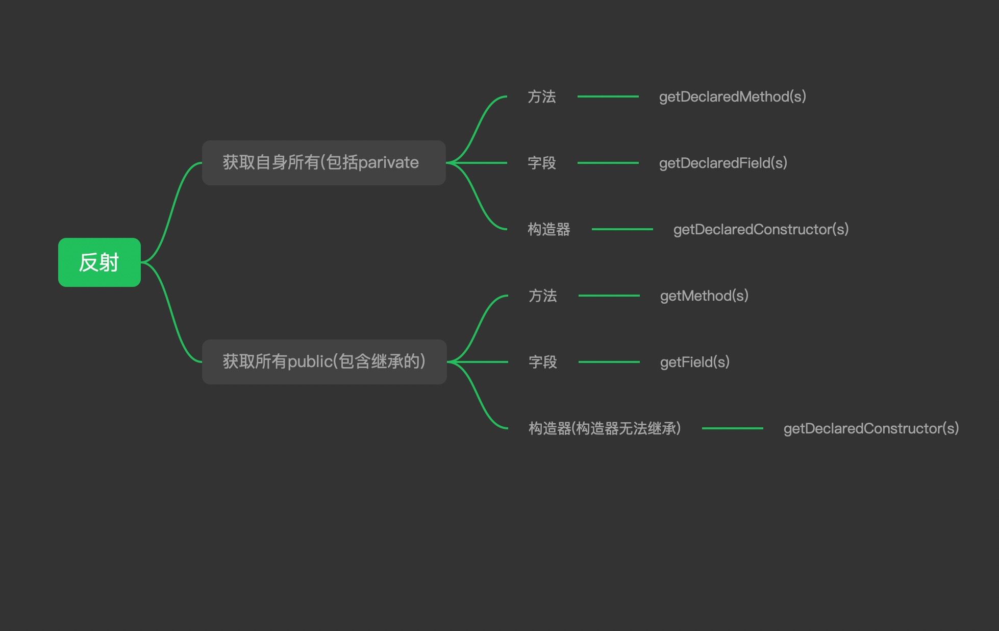

## 思考:
1. 如果完成将字符串反序列化成一个对象? (高难度 有时间的同学可以折腾试试看)

**使用简介**  
1. 如何导入gradle项目(现在不要求掌握什么是gradle)
- https://www.youtube.com/watch?v=0s7YYjQEsfU
- https://www.jetbrains.com/help/idea/gradle.html

2.运行所有测试  
```
./gradlew test
```
3. 运行单个测试可以直接点击对应测试右边的绿色三角形
